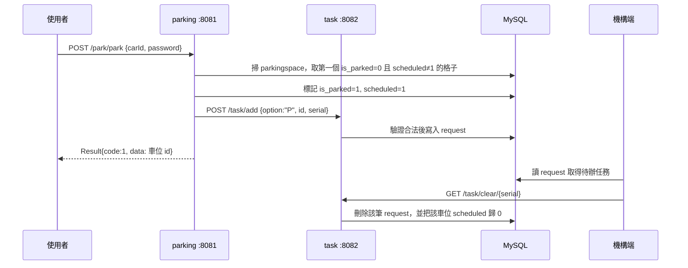

# MakeNTU 2025 — 智慧自動停車場（後端）

自動代客泊車系統的後端。使用者送出「停車」或「取車」請求，系統決定用哪個車位，
並把一張搬運任務交給機構端執行。MakeNTU 2025 企業獎第三名。

## 這個 repo 的範圍

**只有後端。** Spring Boot multi-module，Java + MySQL。

機構端（Arduino / ESP32 韌體）與語音辨識那一段**不在這個 repo**。
後端與它們的唯一介面是下面的 `request` 資料表：機構端輪詢待辦任務、做完後呼叫
`GET /task/clear/{serial}` 銷單。後端不直接控制任何硬體。

## 架構

五個 Maven 模組，三個是可執行的 Spring Boot 服務：

| 模組 | 埠 | 是什麼 |
|---|---|---|
| `makentu15-parking` | 8081 | 車位配置。決定停哪一格、取哪一格，然後開任務單 |
| `makentu15-task` | 8082 | 任務佇列。收單、驗證合法性、寫進 `request` 表、銷單 |
| `makentu15-test` | 8079 | 試打外部服務用的空殼（`testGemini` 目前回空字串） |
| `makentu15-pojo` | — | 跨服務共用的實體：`CarInfo` / `ParkingSpace` / `Request` |
| `makentu15-common` | — | 跨服務共用的回應包裝 `Result<T>` |

停車的完整路徑：



取車（`POST /park/take`）走同一條路，差別在 `option` 是 `"T"`，
而車位是用 `carId` + `password` 比對出來的。

**車位配置目前是 first-fit**：`ParkingServiceImpl.parkCar()` 依序掃過所有車位，
取第一個未占用且未被排定的。沒有距離或分區的權重。

**`parking` 呼叫 `task` 的位址寫死在 `ParkingServiceImpl.submitTaskToMissionSystem()`**
（`http://localhost:8082/task/add`）。兩個服務要在同一台機器上，且 `task` 必須佔用 8082。

## 資料模型

schema 名稱 `makentu2025`，兩張表。程式沒有附建表腳本，欄位由 mapper 的 SQL 決定：

**`parkingspace`** — 每一格車位一列，是系統的狀態真相。

| 欄位 | 意義 |
|---|---|
| `id` | 車位編號，任務單就是用它指名要搬到哪 |
| `is_parked` | 這格現在有沒有車 |
| `scheduled` | 有沒有一張還沒做完的任務指向這格。**防止同一格被重複派工**，銷單時歸 0 |
| `car_id` / `password` | 取車時的憑證，兩個都要對得上 |
| `update_time` | 最後一次異動 |

**`request`** — 待辦任務佇列，空的代表機構端沒事做。

| 欄位 | 意義 |
|---|---|
| `option` | `P` 停車 / `T` 取車 |
| `id` | 目標車位編號 |
| `serial` | 流水號，銷單時用它指名要刪哪一張 |
| `update_time` | 開單時間 |

## API

所有回應都是 `Result<T>`：`{ "code": 1, "msg": null, "data": ... }`。
**`code` 1 是成功、0 是失敗**，錯誤原因放 `msg`。

### parking（:8081）

| 方法 | 路徑 | 送什麼 | 回什麼 |
|---|---|---|---|
| GET | `/park/test` | — | 健康檢查 |
| POST | `/park/park` | `{"carId":"...","password":"..."}` | 配到的車位 id；沒有空位時 `data` 是 `null` |
| POST | `/park/take` | 同上 | 取出的車位 id；憑證對不上時 `data` 是 `null` |
| GET | `/park/all` | — | 所有車位的當前狀態 |

### task（:8082）

| 方法 | 路徑 | 送什麼 | 回什麼 |
|---|---|---|---|
| POST | `/task/add` | `{"option":"P","id":3,"serial":1234}` | 建立的任務 |
| GET | `/task/clear/{serial}` | — | 銷單，並把該車位的 `scheduled` 歸 0 |
| GET | `/task/show` | — | 目前所有待辦任務 |

`/task/add` 會先驗證：車位 id 存在嗎、`option` 是不是 `P`/`T`、
停車的目標是不是空的、取車的目標是不是有車。不合法就退回，錯誤字串在
`TaskFailReason`。

## 跑起來

需要 JDK、Maven，以及一個 MySQL。

```bash
# 1. 建 schema 與兩張表（見上方「資料模型」），並塞入車位列
#    每一格車位一列，is_parked=0、scheduled=0

# 2. 填設定：見下一節

# 3. 先裝一次，讓 common 與 pojo 進本機 repository，服務才編得起來
mvn install -DskipTests

# 4. 兩個服務各自啟動。task 要先起，parking 開單時會直接打它
mvn -pl makentu15-task    spring-boot:run
mvn -pl makentu15-parking spring-boot:run
```

驗一下活著：

```bash
curl localhost:8081/park/test
curl localhost:8081/park/all
curl -X POST localhost:8081/park/park \
     -H 'Content-Type: application/json' \
     -d '{"carId":"ABC-1234","password":"0000"}'
curl localhost:8082/task/show
```

## 設定

每個服務兩個檔：`application.yml` 放不敏感的東西（埠、mybatis、log），
`application-dev.yml` 放連線資訊。連線資訊寫成 `makentu15.datasource.*`，
再由 `application.yml` 組成 `spring.datasource.url` ——
**`makentu15-test/src/main/resources/application.yml` 是這個組法的參考範例。**

```yaml
# application-dev.yml
makentu15:
  datasource:
    driver-class-name: com.mysql.cj.jdbc.Driver
    host: localhost
    port: 3306
    database: makentu2025
    username: <你的帳號>
    password: <你的密碼>
```

**密碼與 API key 不進版控。** 版控裡的值一律是 `${your_password}` 這類佔位字串；
實際的值放在本機未追蹤的覆寫檔，或走環境變數。已經推上去的機密要當成外洩處理——
撤銷、換新，改檔案不算修好。
