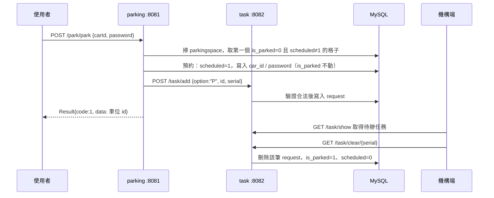

# MakeNTU 2025 — 智慧自動停車場

MakeNTU 2025 智慧自動停車場專案。使用者送出停車或取車請求後，後端配置車位並建立搬運任務；
ESP32 搬運車輪詢任務、依感測器辨識目標車格，完成動作後回報。作品獲友達光電企業獎第三名。

## 專案內容

| 目錄 | 是什麼 |
|---|---|
| `makentu15-*` | 後端：Spring Boot 多模組服務，使用 Java 與 MySQL |
| `firmware/` | 機構端。ESP32 搬運車韌體（Arduino 框架），見下方「機構端」 |
| `prototype/` | C++ 車位配置原型；與後端 `parkCar()` 同樣採 first-fit 策略 |

本儲存庫涵蓋停車後端、搬運車韌體與車位配置原型；語音辨識程式未收錄。
後端與機構端以任務 API 互通：機構端透過 `GET /task/show` 輪詢待辦任務、做完後呼叫
`GET /task/clear/{serial}` 銷單。後端不直接控制任何硬體。

## 架構

五個 Maven 模組，三個是可執行的 Spring Boot 服務：

| 模組 | 埠 | 是什麼 |
|---|---|---|
| `makentu15-parking` | 8081 | 車位配置。決定停哪一格、取哪一格，然後開任務單 |
| `makentu15-task` | 8082 | 任務佇列。收單、驗證合法性、寫進 `request` 表、銷單 |
| `makentu15-test` | 8079 | 外部服務呼叫的實驗模組；`testGemini` 尚未實作回應 |
| `makentu15-pojo` | — | 跨服務共用的實體：`CarInfo` / `ParkingSpace` / `Request` |
| `makentu15-common` | — | 跨服務共用的回應包裝 `Result<T>` |

停車的完整路徑：



取車（`POST /park/take`）走同一條路，差別在 `option` 是 `"T"`，
車位是用 `carId` + `password` 比對出來的，而銷單時是把 `is_parked` 歸 0、憑證清空。

**`parking` 只做預約，不宣稱車已經到位。** `is_parked` 代表「車實際在格子裡」，
只有機構端回報任務完成（`/task/clear/{serial}`）時才會變；`scheduled` 代表「有一張還沒做完的
任務單指向這格」，它才是開單當下就設的那個旗標。兩者分開，任務服務的合法性檢查才驗得到東西——
開單前就把 `is_parked` 寫成 1，檢查看到的會是呼叫方自己剛造成的狀態。

任務送不出去時，`parking` 會把剛才的預約收回來，否則那個格子誰都用不到，而且沒有東西會來清它。

**車位配置目前是 first-fit**：`ParkingServiceImpl.parkCar()` 依序掃過所有車位，
取第一個未占用且未被排定的。沒有距離或分區的權重。

## 機構端（ESP32 韌體）

`firmware/car_demo/car_demo.ino` 是比賽 demo 用的搬運車程式。車子沿主車道前進，
靠地面黑點數出目標車格，轉進去放車或抬車，再倒回入口。

每一輪（約 5 秒）：

1. `GET /task/show` 取回所有待辦任務，逐筆處理。
2. 前進，左側 IR 感測器每偵測到一次「白→黑」就記一個黑點，數到任務的車位 `id` 就停。
3. 左轉進車格，前進到前方 IR 感測器被擋住為止。
4. `P`（停車）放下伺服載台；`T`（取車）抬起。
5. 倒車到後方 IR 感測器被擋住，邊倒邊轉回主車道，再倒回入口。
6. `GET /task/clear/{serial}` 銷單。

| 元件 | 腳位 |
|---|---|
| IR 感測器：左（數黑點）／前（到位）／後（倒車） | 14 ／ 27 ／ 12 |
| 直流馬達 A（IN1, IN2） | 18, 5 |
| 直流馬達 B（IN1, IN2） | 25, 26 |
| 升降伺服馬達 | 32 |

需要的函式庫：`WiFi`、`HTTPClient`（ESP32 內建）、`ArduinoJson`、`ESP32Servo`。

**燒錄前要改三個佔位字串**：`<wifi-ssid>`、`<wifi-password>`、`<task-service-host>`（跑 task 服務那台的 IP）。
比賽現場的網路設定不進版控。

`firmware/sensor-tests/` 是當天拆開驗證各元件的小程式：

| 草稿 | 驗什麼 |
|---|---|
| `count_dot` | IR 感測器數黑點與去抖動 |
| `dist_test`、`dist_test2` | 單顆 HC-SR04 超音波測距 |
| `parking_dist_detection`、`parking_dist_detection_with3` | 用超音波判斷車格有沒有車（< 5 cm 有車、< 2 cm 太貼牆）；後者是左中右三顆 |
| `wifi_try` | ESP32 連網與 HTTP GET |

## 資料模型

schema 名稱 `makentu2025`，兩張表。程式沒有附建表腳本，欄位由 mapper 的 SQL 決定：

**`parkingspace`** — 每一格車位一列，是系統的狀態真相。

| 欄位 | 意義 |
|---|---|
| `id` | 車位編號，任務單就是用它指名要搬到哪 |
| `is_parked` | 車**實際上**在不在格子裡。開單時不動，銷單時才變 |
| `scheduled` | 有沒有一張還沒做完的任務指向這格。**防止同一格被重複派工**，銷單時歸 0 |
| `car_id` / `password` | 取車時的憑證，兩個都要對得上。停車預約時寫入，取車完成時清掉 |
| `update_time` | 最後一次異動 |

**`request`** — 待辦任務佇列，空的代表機構端沒事做。

| 欄位 | 意義 |
|---|---|
| `option` | `P` 停車 / `T` 取車 |
| `id` | 目標車位編號 |
| `serial` | 流水號，銷單時用它指名要刪哪一張 |
| `update_time` | 開單時間 |

## API

所有回應都是 `Result<T>`：`{ "code": 1, "msg": null, "data": ... }`。
**`code` 1 是成功、0 是失敗**，錯誤原因放 `msg`。

### parking（:8081）

| 方法 | 路徑 | 送什麼 | 回什麼 |
|---|---|---|---|
| GET | `/park/test` | — | 健康檢查 |
| POST | `/park/park` | `{"carId":"...","password":"..."}` | 配到的車位 id；沒有空位時 `data` 是 `null` |
| POST | `/park/take` | 同上 | 取出的車位 id；憑證對不上時 `data` 是 `null` |
| GET | `/park/all` | — | 所有車位的當前狀態 |

### task（:8082）

| 方法 | 路徑 | 送什麼 | 回什麼 |
|---|---|---|---|
| POST | `/task/add` | `{"option":"P","id":3,"serial":1234}` | 建立的任務 |
| GET | `/task/clear/{serial}` | — | 銷單，並把車位改成任務完成後該有的樣子 |
| GET | `/task/show` | — | 目前所有待辦任務 |

`/task/add` 會先驗證：車位 id 存在嗎、`option` 是不是 `P`/`T`、有沒有帶流水號、
停車的目標是不是空的、取車的目標是不是有車。不合法就退回，錯誤字串在 `TaskFailReason`。

**流水號是必填的**：它是之後銷單唯一的依據，缺了就會變成一張沒人關得掉的任務單，
指向的車位也會一直掛著預約。

## 跑起來

需要 JDK、Maven，以及一個 MySQL。

```bash
# 1. 建 schema 與兩張表（見上方「資料模型」），並塞入車位列
#    每一格車位一列，is_parked=0、scheduled=0

# 2. 填設定：見下一節

# 3. 先裝一次，讓 common 與 pojo 進本機 repository，服務才編得起來
mvn install -DskipTests

# 4. 兩個服務各自啟動。task 要先起，parking 開單時會直接打它
mvn -pl makentu15-task    spring-boot:run
mvn -pl makentu15-parking spring-boot:run
```

驗一下活著：

```bash
curl localhost:8081/park/test
curl localhost:8081/park/all
curl -X POST localhost:8081/park/park \
     -H 'Content-Type: application/json' \
     -d '{"carId":"ABC-1234","password":"0000"}'
curl localhost:8082/task/show
```

## 設定

每個服務兩個檔：`application.yml` 放不敏感的東西（埠、mybatis、log），
`application-dev.yml` 放連線資訊。連線資訊寫成 `makentu15.datasource.*`，
再由 `application.yml` 組成 `spring.datasource.url`。三個服務的寫法一致。

```yaml
# application-dev.yml
makentu15:
  datasource:
    driver-class-name: com.mysql.cj.jdbc.Driver
    host: localhost
    port: 3306
    database: makentu2025
    username: <你的帳號>
    password: <你的密碼>
```

`parking` 還多一項 `makentu15.task.url`（預設 `http://localhost:8082`）——
兩個服務不在同一台機器時改這裡。

**密碼與 API key 不進版控。** 版控裡的值一律是 `${your_password}` 這類佔位字串；
實際的值放在本機未追蹤的覆寫檔，或走環境變數。已經推上去的機密要當成外洩處理——
撤銷、換新，改檔案不算修好。
